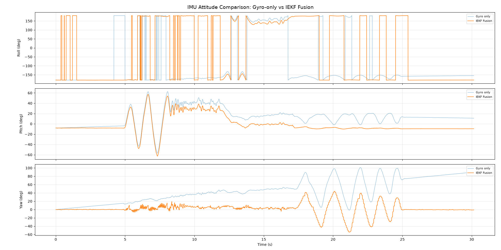

# AHRS

> MPU6050 + HMC5883L 九轴姿态航向参考系统，基于左不变扩展卡尔曼滤波（Left-Invariant EKF）



## 快速开始

### 编译

```bash
make
```

### 运行

```bash
# IEKF（默认噪声参数）
./main iekf

# IEKF 自定义噪声参数
./main iekf <σ_gyro> <σ_accel> <σ_bias>

# 示例
./main iekf 0.05 0.5 0.0003
```

### 参数说明

| 参数 | 含义 | 典型值 |
|---|---|---|
| `σ_gyro` | 陀螺仪噪声密度 (rad/s/√Hz) | 0.01（优）~ 0.1（差） |
| `σ_accel` | 加速度计噪声 (m/s²) | 0.2（优）~ 1.0（差） |
| `σ_bias` | 陀螺仪偏置随机游走 (rad/s/√s) | 0.0001 ~ 0.001 |

## 项目结构

```
AHRS/
├── Makefile                 
├── README.md
├── doc/
│   └── Figure_1.png        # 效果预览
└── src/
    ├── main.cpp             # 入口，命令行解析，主循环
    ├── mag_calib_main.cpp   # 磁力计椭球校准工具
    ├── calibration/
    │   └── mag_calibration.h # 硬铁+软铁椭球拟合校准
    ├── platform/
    │   ├── iic_interface.h  # I2C 抽象接口
    │   └── iic_linux.cpp    # Linux I2C 实现（/dev/i2c-N）
    ├── driver/
    │   ├── mpu6050_reg.h    # MPU6050 全部寄存器 & 配置枚举
    │   ├── mpu6050.h        # MPU6050 传感器驱动类
    │   ├── mpu6050.cpp      # MPU6050 初始化、6轴读取、温度
    │   ├── hmc5883l_reg.h   # HMC5883L 寄存器定义
    │   ├── hmc5883l.h       # HMC5883L 磁力计驱动类
    │   └── hmc5883l.cpp     # HMC5883L 初始化、3轴读取
    ├── fusion/
    │   ├── fusion_interface.h  # 融合算法统一接口 + quat→euler + rad↔deg
    │   ├── iekf.h              # Left-Invariant EKF 声明
    │   └── iekf.cpp            # 6×6 协方差、预测/更新、陀螺仪偏置估计
    └── debug/
        └── debug_logger.h      
```

## 移植

换平台只需实现 `IICInterface` 三个方法：

```cpp
class IICInterface {
    virtual bool writeRegister(uint8_t dev_addr, uint8_t reg, uint8_t data) = 0;
    virtual bool readRegisters(uint8_t dev_addr, uint8_t reg, uint8_t* buffer, size_t length) = 0;
    virtual void delayMs(unsigned int ms) = 0;
};
```

驱动层和融合层代码完全不动。已有实现：

- `iic_linux.cpp` — Linux / Raspberry Pi / Luckfox
- 可扩展：Arduino Wire、STM32 HAL、ESP-IDF

## TODO

- [ ] 优化计算效率
- [ ] 高加速度场景下收敛速度不足，需修正自适应 Q 策略或引入加速度计量测异常检测

## License

MIT
